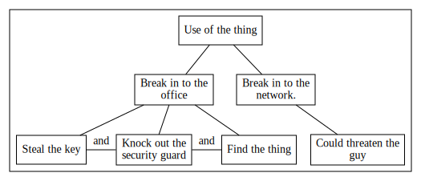

Exteremely crude  tool for drawing attack trees.

Will put more here when I can remember what it does.

Example input:

```
Use of the thing
  Break in to the office
    Steal the key |AND
    Knock out the security guard |AND
    Find the thing
  Break in to the network.
    Could threaten the guy
```

Render with:

`cat input.txt | ./atree | dot -Tsvg > out.svg`

Output:



